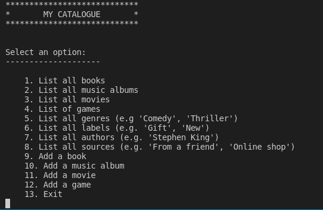

# Catalog of Things - Ruby Capstone

In this project, we created a console app that will help users to keep a record of different types of things you won: books, music albums, movies, and games. Everything based on the [UML](https://github.com/microverseinc/curriculum-ruby/blob/main/group-capstone/images/catalog_of_my_things.png) class diagram. The data stored in JSON files but we also prepared a database with tables structure analogical to our program's classes structure.

## Preview
<!--  -->
  


## Table of Contents

- [Description](#description)
- [Built With](#built-with)
- [Getting Started](#getting-started)
- [Prerequisites](#prerequisites)
  - [MacOS](#macos)
  - [Ubuntu](#ubuntu)
  - [Windows](#windows)
- [Setup](#setup)
- [Usage](#usage)
- [Testing](#testing)
- [Database](#database)
- [Collaborators](#collaborators)
- [Show Your Support](#how-your-support)
- [Acknowledgments](#acknowledgments)
- [License](#license)

## Description 
> A console app that will help you to keep a record of different types of things you won: books, music albums, movies, and games.
<hr>


## Built With

- Technologies: `Ruby`, `PostgreSQL`, `RSpec`

## Getting Started

Check the following instructions to install and use the project in you local machine!
## Prerequisites

To begin with, you need to be able to use the **ruby** command, if you don't have it you can install it using any of these commands: 

### **MacOS**

```bash
brew install rbenv ruby-build
# Add rbenv to bash so that it loads every time you open a terminal
echo 'if which rbenv > /dev/null; then eval "$(rbenv init -)"; fi' >> ~/.bash_profile
source ~/.bash_profile

# Install Ruby
rbenv install 3.0.1
rbenv global 3.0.1
ruby -v
```
<hr>

### **Ubuntu**

```bash
git clone https://github.com/rbenv/rbenv.git ~/.rbenv
echo 'export PATH="$HOME/.rbenv/bin:$PATH"' >> ~/.bashrc
echo 'eval "$(rbenv init -)"' >> ~/.bashrc
exec $SHELL

git clone https://github.com/rbenv/ruby-build.git ~/.rbenv/plugins/ruby-build
echo 'export PATH="$HOME/.rbenv/plugins/ruby-build/bin:$PATH"' >> ~/.bashrc
exec $SHELL

rbenv install 3.0.1
rbenv global 3.0.1
ruby -v
```
<hr>

### **Windows**

Use **[WSL](https://docs.microsoft.com/en-us/windows/wsl/about)**
<hr>

## Setup

Once you have installed **ruby** you need to clone this project's repository, use this command in your terminal:


```bash
$ git clone https://github.com/aimemalaika/catalog-ruby.git
$ cd catalog-ruby
```
<hr>

## Usage

To open the app in your terminal run this command:

``` bash
$ ruby ./main.rb
```
<hr>

## Testing

``` bash
$ rspec ./spec
```
<hr>

## Database
This repository includes files with plain SQL that can be used to recreate a database:

1. Run this in your bash terminal to gain access to postgres command line
~~~ bash
$ psql postgres
~~~

2. Create a new database with any name ('vet-clinic' is suggested), and connect to that database.
~~~ postgres
# CREATE DATABASE <database_name>;
# \c <database_name>
~~~

3. Use [schema.sql](./schema.sql) to create all tables. Copy and paste the content of this file into the postgres command line. That should create the tables in your database.
Now verify it. The following command displays all tables in your database:
~~~ postgres
# \d
~~~

### And that's pretty much all. At this point, feel free to experiment by inserting data and running queries!
<hr>

## Collaborators

👤 **Aime Malaika**
 Platform | Badge |
 --- | --- |
 **GitHub**  | [@aimemalaika](https://github.com/aimemalaika)
 **Twitter** | [@aimemalaika](https://twitter.com/Aime_Malaika)
 **LinkedIn** | [aimemalaika](https://linkedin.com/in/aimemalaika)

<hr>

👤 **Kyrillos**

 Platform | Badge |
 --- | --- |
 **GitHub**  | [@bondok6](https://github.com/Bondok6)
 **Twitter** | [@kyrillos](https://twitter.com/kyrilloshany99)
 **LinkedIn** | [kyrillos](https://www.linkedin.com/in/kyrillos-hany/)
 <hr>

👤 **Eduardo**

 Platform | Badge |
 --- | --- |
 **GitHub**  | [@eduardosancho](https://github.com/eduardosancho)
 **Twitter** | [@sanchitobless](https://twitter.com/sanchitobless)
 **LinkedIn** | [Eduardo](https://www.linkedin.com/in/eduardo-sancho-solano/)
<hr>
 

## Show your support

Give a ⭐️ if you like this project!
<hr>

## Acknowledgments

The ideas and inspiration from this project are coming from this online school of software development:

## [**Microverse**](https://www.microverse.org/)
<hr>

## 📝 License

This project is [MIT](./MIT.md) licensed.
